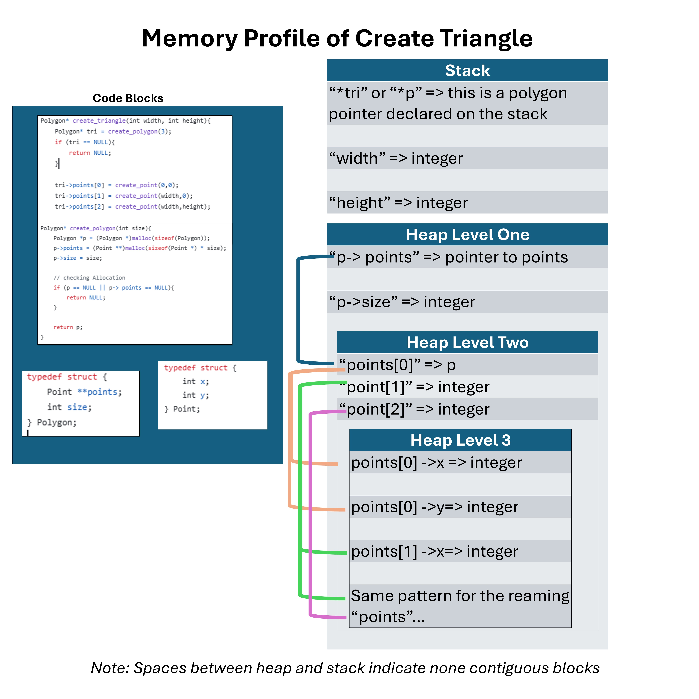
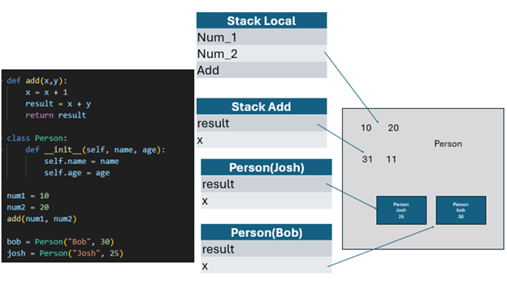

# Homework - C Practice Report

Completely answer the report questions below. Make sure to double check the final version to make sure it is easily readable on your github repository. 


1. What is the difference between a standard numeric type (int, float, double) and a pointer?

__Answer__:

```c
int std_type = 4;
printf("std_type = %d\n", std_type);
printf("std_type address is %p\n", &std_type);
int *ptr = &std_type;
printf("what ptr point to = %d\n",  *ptr);
printf("ptr = %p\n", ptr);
// output:
// std_type = 4
// std_type address is 0x7ffc74f12c6c
// what ptr points to = 4
// ptr = 0x7ffc74f12c6c
```
The example above outlines the key differences between standard numeric types and pointers. In short, standard numeric type represents a value while a pointer represents and address to which “points” to an address in memory. Let break down the example above and discuss this firther
On the first line, we assign a value to a basic numeric type int. From there, we print std_type which is the number four, but that number four has a memory address. Using pointers we assign std_type's address to a pointer named ptr. Ptr now represents an address and we can follow the address (using *ptr) to a given value.

   
2. In your test file, we had the following code:
    
    ```c
    int* arr = create_array_of_ints_fib(5);
    int expected[] = {1, 1, 2, 3, 5};
    ```
    Later in the code we only `free(arr)` but not expected. Why is this? What is the difference in where they are stored in memory?

__Answer:__

In that code we are returning a pointer to an array. Given that we want all the array's values to persist, we know that `create_array_of_ints_fib` must have allocated its array values on the heap. Items allocated on the heap persist after function calls and therefore we must `free(arr)` to avoid memory leaks.

3. What is the difference between the heap and stack when related to memory allocation and management?

__Answer:__

```c
int* makeHeapVariable (){
    // heap Memory
    int *arr = malloc(5 * sizeof(int));
    arr[0] = 1; arr[1] = 2; arr[2] = 3; arr[3] = 4; arr[4] = 5;
    return arr;
}
int* makeStackVariable(){ // int* not *int
    int arr[] = {1,2,3,4,5};
    return arr; // This is dangerous!
}
```
Heap and stack memory serve different purposes when it comes to their use in a program. Stack memory gets automatically allocated when functions are called in a program and then gets deallocated once the function call is finished. Heap memory is long-lasting memory and must be allocated and deallocated by the developer.

Let's make use of the example above. The `makeHeapVariable` returns a pointer to an array. An array points to its first memory address and then all other values get their addresses indexed through pointer math (*ptr+1). This array will live past the function call since it is allocated on the heap.

The second function makeStackVariable is a different story. This function also returns a pointer to an array, but the values allocated to the array will get removed from stack memory once finished. The correct address to the pointer will be returned but the value at that array will be different, undefined, or something else completely random.


4. Take the following code:
   ```c
   #include <stdio.h>
   #include <stdlib.h>

   typedef struct {
     int x, y;
   } Point;

   Point * new_point(int x, int y) {
     Point pt = {x, y};
     return &pt;
   }

   int main() {
      Point* point = new_point(10, 10);
      printf("x: %d, y: %d", point->x, point->y);
      return 0;
   }
   ```
   Would the code run correctly? Even if it does compile, what would be some potential runtime issues? After answering your thoughts, put the output of a run below (you may need to run it a few times).

   __Answer__:

I would not expect the code above to run correctly. This is a similar answer to question 3. The issue here is that we are allocating our array to stack memory. Stack memory gets deallocated after the function call is over. An array points to its first memory address and all other values get indexed through pointer math (pointer +1). The issue here is that all those values in that array were deallocated after the call. The address to the array is correct, but the values may still be there, may be allocated with different numbers, or may be undefined.


   ```text
   x: 10, y: 10
   x: 10, y: 10
   x: 10, y: 10
   x: 10, y: 10
   ```

   Fix the code in the following block:
   ```c
   #include <stdio.h>
   #include <stdlib.h>

   typedef struct {
     int x, y;
   } Point;

   Point * new_point(int x, int y) {
    int *arr = malloc(5 * sizeof(int));
    arr[0] = x; 
    arr[1] = y; 
    return arr;
   }

   int main() {
      Point* point = new_point(10, 10);
      printf("x: %d, y: %d", point->x, point->y);
      return 0;
   }
   ```

5. When you use `malloc`, where are you storing the information?

__Answer:__

When we use malloc in C, we are establishing storage in heap memory. This type of storage persists across function calls and must be deallocated or free()d after use.


6. Speaking about `malloc` and `calloc`, what is the difference between the two (you may need to research it!)?


__Answer:__

malloc and calloc are similar because they both define storage on the heap. They differ in respect to how they define that storage. malloc merely sets aside a block of memory while calloc zeros out that memory. calloc and malloc also have different parameters. malloc just needs the size of the memory to set aside while calloc needs the unit size and the number of units.

7. What are some common built in libraries used for C, list at least 3 and explain each one in your own words. Name a few (at least 3) functions in those libraries (hint: we used two of the most common ones in this assignment. There are many resources online that tell you functions in each library - you need to include at least 1 reference, but ideally for every library, you should have a reference to it)?
   - Example: stdlib.h - provides functions for general-purpose operations including 
              memory management and random numbers [1].
     - void * malloc(size_t) - allocates memory specified in size on the heap and returns a pointer to that location
     - void * calloc(size_t num_elements, size_t element_size) - contiguous allocation for allocating arrays with the default value of 0. Slower than malloc. 
     - int rand(void) - returns a random integer between 0 and RAND_MAX. Seed should be set before hand. 


   1. math.h: this is `c` mathematical library and it contains basic and common math operations. [3]
      * ceil(x) -> returns a number rounded to the nearest whole number
      * log(x) ->  returns the natrual log of x
      * pow(x,y) -> calculates x^y

      reference: https://www.w3schools.com/c/c_ref_math.php
   
   2. string.h: this library contains logic for manipulating and mutating strings in C [4]
      * strcat() -> concats two string together
      * strlen() - > returns the length of a string
      * strtok() -> splits a string by a delimiter, and then you can index each string piece
 reference: https://www.w3schools.com/c/c_ref_string.php

   3. stdio.h: This library contains all the functions for input and output logic in c.[5]
      * fclose() -> closes a file 
      * printf() -> writes a formated strings to the console
      * puts() -> prints a string to the console
 

8. Looking at the struct Point and Polygon, we have a mix of values on the heap, and we make ample use of pointers. Take a moment to draw out how you think that looks after `create_triangle(2,3)` is called (see an example below). The important part of the drawing it to see that not everything is stored together in memory, but in different locations! Store the image file in your github repo and link it here. You can use any program to draw it such as [drawIO](https://app.diagrams.net/), or even draw it by hand and take a picture of it. 



## Technical Interview Practice Questions
For both these questions, are you are free to use what you did as the last section on the team activities/answered as a group, or you can use a different question.

1. Select one technical interview question (this module or previous) from the [technical interview list](https://github.com/CS5008-khoury/Resources/blob/main/TechInterviewQuestions.md) below and answer it in a few sentences. You can use any resource you like to answer the question.
//hw_additional_material/memory_profile_triangle.jpg

__Question: What exactly is a terminal and why is it important?__
The terminal goes by many names: the command line, bash, PowerShell, console, and so on. This tool provides users with a programmatic way to interact with their operating system. This functionality may seem archaic, but it comes in handy in unique ways.
Since you interact with the console via code, you can now script with it, and with scripting you receive all the benefits of programmable logic. For example, imagine you want to only transfer PDF, XLSX, and DOCX files to a server. This can easily be done with a simple for loop, conditional, and curl command via Linux. Can you imagine doing this by clicking and dragging 50,000 documents?
The terminal is so handy it's often considered the standard for all developers and thus a common language. You could be a Python developer or a C developer or maybe love SAS. All these people probably know at least a little bit of Linux or Windows terminal commands. In fact, and this is a little anecdotal, several popular Python libraries are shifting more and more towards mainly command line interfaces—for example, spaCy.


3. Select one coding question (this module or previous) from the [coding practice repository](https://github.com/CS5008-khoury/Resources/blob/main/LeetCodePractice.md) and include a c file with that code with your submission. Make sure to add comments on what you learned, and if you compared your solution with others.

__Answer:__
```c
/**
 * Note: The returned array must be malloced, assume caller calls free().
 * Question: Given an array of integers nums and an integer target, return 
 * indices of the two numbers such that they addup to target.
 * You may assume that each input would have exactly one solution, and you may not use the same element twice.
 * You can return the answer in any order.
 */
int* twoSum(int* nums, int numsSize, int target, int* returnSize) {
        int current_i_th_value;
        int addition_results;
        int* my_result_vector;

        for (int i = 0; i < numsSize; i++ ){
            current_i_th_value = nums[i];
            for(int j = i+1; j < numsSize; j++ ){
                addition_results = current_i_th_value + nums[j];
                if ( addition_results == target){
                    my_result_vector = (int*)malloc(2 * sizeof(int));
                    my_result_vector[0] = i;
                    my_result_vector[1] = j;
                    *returnSize = 2;
                    return my_result_vector;
                }
            }
        }
    return NULL;
};
/**
* Comments
* I think the problem that was given was easy to quickly wrap my head around, and 
* I even understood how to acquire a run of O(n) within a short amount of time. I 
* think what I still find hard about C is the idea of pointers, and not having objects.
* For example, it took me a minute to realize that the user would need a required length
* to know how to run my function.
*/
```


## Deeper Thinking
In Java and Python, do you think new objects are stored on the stack or the heap? Feel free to work through your thoughts as to why it would be better to store them on the stack or heap. You should consider pass by reference, and how that is similar to pointer in your answer. Feel free to use resources, but make sure to cite them, and include the citation below using ACM format. You will note LLMs are not valid references, but they can give you directions to valid references. Make sure to use your own words. 

Answer here using a paragraph (not just bullet points). 

__Answer:__



In this paper will explore how Python manage stack and heap memory. Unlike C, Python and Java, high order languages, handles heap and stack memory dynamically. Understanding how each of these languages handles stack and heap allows us as developers to code properly and choose the right tool for the right job

The diagram attempts to explain how memory gets allocated in python. Stack memory is generally used to store addresses or pointers while the heap is used to store the actual values of the objects they point to. 
Let’s dive deeper into the example above. When we call `add` a new stack frame gets created which stores the instance of variables of add. When the function add is finished its stack frame gets deleted. In python the garbage collector keeps track of how many references an item has on heap. Once a heap object has no more reference, the garbage collector removes it from memory. It also important to note that integers are immutable so when we add `x+1` we are creating a new instance of an object.[2,6]

In the above example we also see that instances of person and also the class gets stored on the heap. When a new object is created, it gets stored on the heap along with all its corresponding values.In my opinion, and I'm sure this is situationally dependent, it makes sense for python to generally store objects on the heap and addresses on the stack. First, stack access is generally considered faster and therefore reading, writing and deleting addresses needs to be fast. Also, python defines what needs to be removed from the heap dependent on the address it has corresponding to an object, so we want this to be quick. Also the LIFO paradigm lends itself well to writing and deleting addresses to objects. Additionally, the heap is dynamic and can grow as the program progresses and therefore storing objects with a heavier byte footprint, without having direct control, makes intuitive sense for it to be stored on the heap.[7]


## References
Add any references you use here. Use ACM style formatting, adding to the numbers as you add the reference. 

1. cppreference.com Contributors. 2025. Standard library header <stdlib.h>. cppreference.com. Retrieved May 1, 2025 from https://en.cppreference.com/w/c/header/stdlib

2. #26 Stack And Heap in Java (no date) YouTube. Available at: https://www.youtube.com/watch?v=_GK3WoFFKUE (Accessed: 15 September 2025).

3. C math (math.h) Library (no date) Reference. Available at: https://www.w3schools.com/c/c_ref_math.php (Accessed: 15 September 2025).
   
4. C stdio (stdio.h) Library (no date) Standard Input and Output Reference. Available at: https://www.w3schools.com/c/c_ref_stdio.php (Accessed: 15 September 2025).

5. C string (string.h) Library (no date) w3schools. Available at: https://www.w3schools.com/c/c_ref_string.php (Accessed: 15 September 2025).

6. simplefunde (no date) Memory Allocation and Management in Python - simplified tutorial for beginners, YouTube. Available at: https://www.youtube.com/watch?v=arxWaw-E8QQ (Accessed: 15 September 2025).

7. Gribble, P. (n.d.). 7_Memory_Stack_vs_Heap. 7. memory : Stack vs heap. https://gribblelab.org/teaching/CBootCamp/7_Memory_Stack_vs_Heap.html#:~:text=Unlike%20the%20stack%2C%20the%20heap,be%20resized%20using%20realloc() 

## Resource/Help: Linking to images?
To link an image, you use the following code

```markdown

```
for example
```markdown

```


Here is a sample using: 
```c
void my_func() {
    Polygon* r = create_rectangle(5,5);
    printf("The area of the rectangle is %d\n", area(r));
}
```


Note: This is a simplified version. However, it helps illustrate why we need to use `free` on the pointers in the struct. If we do not, we will have memory leaks! (memory that is allocated, but not freed, and thus cannot be used by other programs). In the above example code, `r` is created, and then the variable is destroyed when the function ends. However, the memory allocated for the struct is not freed, and thus we have a memory leak.

When you work on your version for `create_triangle(2, 3)`, you do not have to be exact on the memory structure (the locations on the heap were randomly chosen). The idea is more to show how the memory is stored, and the pointers to different memory addresses. 

